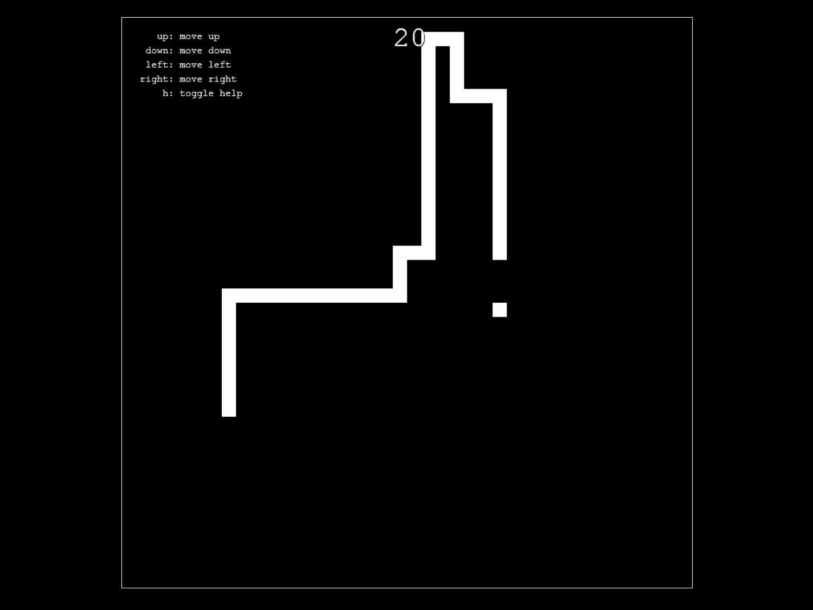

# snake
JavaScript implementation of <a href="https://en.wikipedia.org/wiki/Snake_(video_game)">Snake</a>. Check it out at <a href='http://echevarria.io/code/snake/'>echevarria.io</a>.

## Controls
<ul>
  <li>Press <code>up</code> to move up</li>
  <li>Press <code>down</code> to move down</li>
  <li>Press <code>left</code> to move left</li>
  <li>Press <code>right</code> to move right</li>
  <li>Press <code>right</code> to move right</li>
  <li>Press <code>h</code> to toggle help</li>
</ul>

## Citations
<ul>
  <li>index.html styling from <a href = https://github.com/kelvinabrokwa>Kelvin Abrokwa</a>'s <a href = https://github.com/kelvinabrokwa/nd-gol/>nd-gol</a></li>
</ul>
